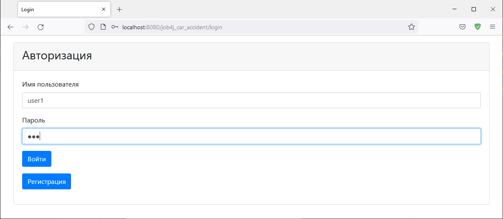
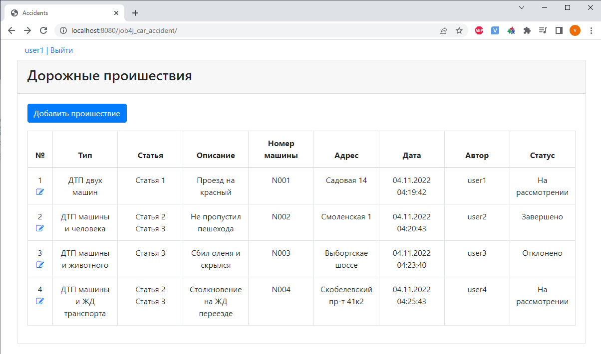
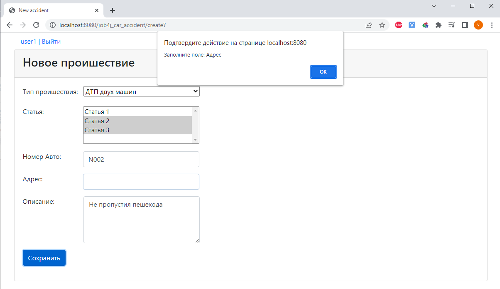
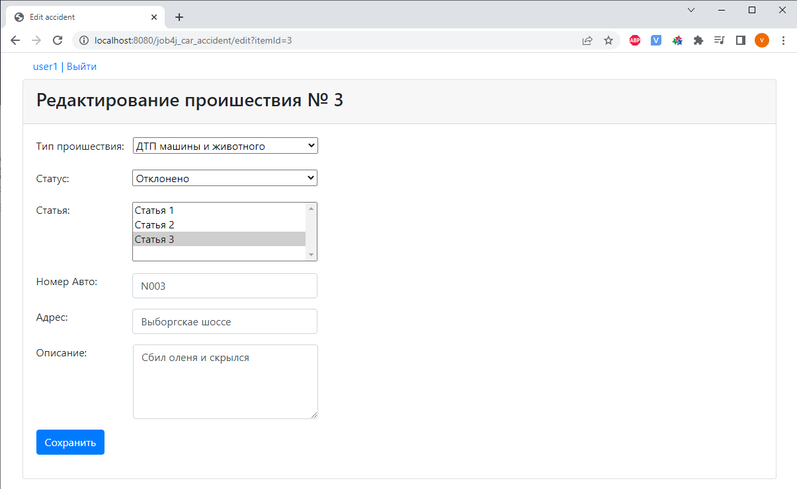

[](https://app.travis-ci.com/VadimShein/job4j_car_accident)

# <p align="center">Сервис регистрации автонарушений</p>

## Описание:
Пользователи проходят регистрацию и авторизацию, после чего добавляют в систему обнаруженные автонарушения.
На главной странице отображаются все произошедшие нарушения. 
У каждого нарушения указывается его тип, описание и список подходящих статей.
Нарушение может имееть один из статусов: на рассмотрении, отклонено, завершено.
Пользователи могут редактировать созданные заявки.

## Используемые технологии:
* Java 13
* Spring MVC, Spring Data, Spring Security, Tomcat
* HTML, Bootstrap, CSS, JSP, JSTL
* PostgreSQL
* Maven

## Скриншоты:
1. Авторизация пользователя



2. Главная страница. Список призошедших нарушений



3. Страница добавления нового нарушения



4. Страница редактирования нарушения




## Запуск проекта:
1. Скопировать проект 
```
git clone https://github.com/VadimShein/job4j_car_accident
```

2. Создать базу данных car_accident и таблицы
Из файла src/main/resources/db/

3. Выполнить сборку проекта 
```
mvn clean package -DskipTests
```

4. Запустить приложение, адрес по умолчанию  [http://localhost:8080/](http://localhost:8080/)
Получившийся после сборки проекта файл accident-1.0.war скопировать в каталог webapps Tomcat сервера. 
Выполнить настройку на веб-сервере для доступа к проекту через вебраузер.


## Контакты:
[](https://t.me/SheinVadim)
[](mailto:shein.v94@mail.ru)


